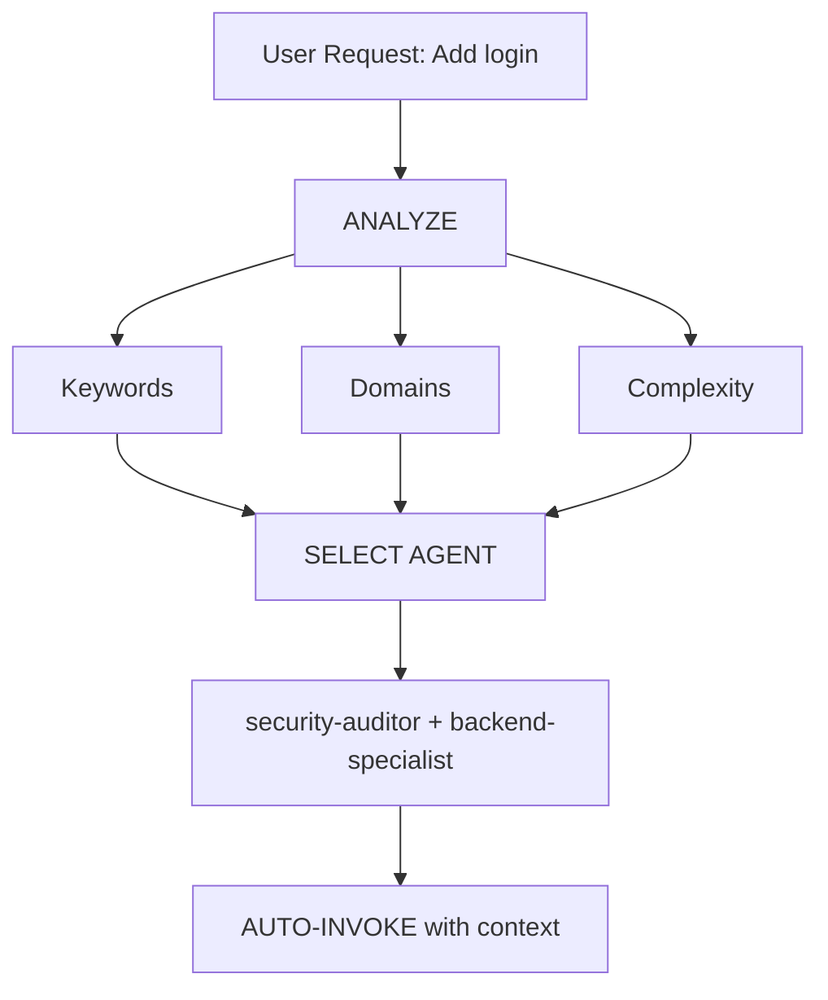

## Overview

The intelligent-routing skill enables automatic analysis of user requests and routes them to the most appropriate specialist agent(s) without requiring explicit user mentions. The AI acts as an intelligent Project Manager, selecting the best specialist for each job.

## What This Skill Provides

- **Automatic request analysis**: Detects domains, complexity, and intent
- **Agent selection matrix**: Rules for choosing appropriate agents
- **Domain detection**: Identifies single vs multi-domain tasks
- **Complexity assessment**: Simple, moderate, or complex task classification
- **Transparent communication**: Informs user which expertise is being applied
- **Override capability**: Users can still explicitly mention agents

## Core Principle

**The AI should act as an intelligent Project Manager**, analyzing each request and automatically selecting the best specialist(s) for the job.

## How It Works

### 1. Request Analysis



Before responding to ANY request, perform automatic analysis:
1. **Classify request type**: What is being asked?
2. **Detect domains**: Which expertise areas are involved?
3. **Determine complexity**: Simple, moderate, or complex?
4. **Select agent(s)**: Single agent, multiple agents, or orchestrator?

### 2. Agent Selection Matrix

| User Intent | Keywords | Selected Agent(s) | Auto-invoke? |
|------------|----------|-------------------|-------------|
| **Authentication** | "login", "auth", "signup", "password" | `security-auditor` + `backend-specialist` | ✅ YES |
| **UI Component** | "button", "card", "layout", "style" | `frontend-specialist` | ✅ YES |
| **Mobile UI** | "screen", "navigation", "touch", "gesture" | `mobile-developer` | ✅ YES |
| **API Endpoint** | "endpoint", "route", "API", "POST", "GET" | `backend-specialist` | ✅ YES |
| **Database** | "schema", "migration", "query", "table" | `database-architect` + `backend-specialist` | ✅ YES |
| **Bug Fix** | "error", "bug", "not working", "broken" | `debugger` | ✅ YES |
| **Test** | "test", "coverage", "unit", "e2e" | `test-engineer` | ✅ YES |
| **Deployment** | "deploy", "production", "CI/CD", "docker" | `devops-engineer` | ✅ YES |
| **Security Review** | "security", "vulnerability", "exploit" | `security-auditor` + `penetration-tester` | ✅ YES |
| **Performance** | "slow", "optimize", "performance", "speed" | `performance-optimizer` | ✅ YES |
| **Product Def** | "requirements", "user story", "backlog", "MVP" | `product-owner` | ✅ YES |
| **New Feature** | "build", "create", "implement", "new app" | `orchestrator` → multi-agent | ⚠️ ASK FIRST |
| **Complex Task** | Multiple domains detected | `orchestrator` → multi-agent | ⚠️ ASK FIRST |

### 3. Automatic Routing Protocol

**TIER 0 - Automatic Analysis (ALWAYS ACTIVE)**

Before responding to ANY request:

```javascript
function analyzeRequest(userMessage) {
    // 1. Classify request type
    const requestType = classifyRequest(userMessage);

    // 2. Detect domains
    const domains = detectDomains(userMessage);

    // 3. Determine complexity
    const complexity = assessComplexity(domains);

    // 4. Select agent(s)
    if (complexity === "SIMPLE" && domains.length === 1) {
        return selectSingleAgent(domains[0]);
    } else if (complexity === "MODERATE" && domains.length <= 2) {
        return selectMultipleAgents(domains);
    } else {
        return "orchestrator"; // Complex task
    }
}
```

## Domain Detection Rules

### Single-Domain Tasks (Auto-invoke Single Agent)

| Domain | Patterns | Agent |
|--------|----------|-------|
| **Security** | auth, login, jwt, password, hash, token | `security-auditor` |
| **Frontend** | component, react, vue, css, html, tailwind | `frontend-specialist` |
| **Backend** | api, server, express, fastapi, node | `backend-specialist` |
| **Mobile** | react native, flutter, ios, android, expo | `mobile-developer` |
| **Database** | prisma, sql, mongodb, schema, migration | `database-architect` |
| **Testing** | test, jest, vitest, playwright, cypress | `test-engineer` |
| **DevOps** | docker, kubernetes, ci/cd, pm2, nginx | `devops-engineer` |
| **Debug** | error, bug, crash, not working, issue | `debugger` |
| **Performance** | slow, lag, optimize, cache, performance | `performance-optimizer` |
| **SEO** | seo, meta, analytics, sitemap, robots | `seo-specialist` |
| **Game** | unity, godot, phaser, game, multiplayer | `game-developer` |

### Multi-Domain Tasks (Auto-invoke Orchestrator)

If request matches **2+ domains from different categories**, automatically use `orchestrator`:

```
Example: "Create a secure login system with dark mode UI"
→ Detected: Security + Frontend
→ Auto-invoke: orchestrator
→ Orchestrator will handle: security-auditor, frontend-specialist, test-engineer
```

## Complexity Assessment

### SIMPLE (Direct agent invocation)
- Single file edit
- Clear, specific task
- One domain only
- Example: "Fix the login button style"

**Action**: Auto-invoke respective agent

### MODERATE (2-3 agents)
- 2-3 files affected
- Clear requirements
- 2 domains max
- Example: "Add API endpoint for user profile"

**Action**: Auto-invoke relevant agents sequentially

### COMPLEX (Orchestrator required)
- Multiple files/domains
- Architectural decisions needed
- Unclear requirements
- Example: "Build a social media app"

**Action**: Auto-invoke `orchestrator` → will ask Socratic questions

## Response Format

When auto-selecting an agent, inform the user concisely:

```markdown
🤖 **Applying knowledge of `@security-auditor` + `@backend-specialist`...**

[Proceed with specialized response]
```

**Benefits**:
- ✅ User sees which expertise is being applied
- ✅ Transparent decision-making
- ✅ Still automatic (no /commands needed)

## Implementation Rules

### Rule 1: Silent Analysis
**DO NOT announce "I'm analyzing your request..."**
- ✅ Analyze silently
- ✅ Inform which agent is being applied
- ❌ Avoid verbose meta-commentary

### Rule 2: Inform Agent Selection
**DO inform which expertise is being applied:**

```markdown
🤖 **Applying knowledge of `@frontend-specialist`...**

I will create the component with the following characteristics:
[Continue with specialized response]
```

### Rule 3: Seamless Experience
**The user should not notice a difference from talking to the right specialist directly.**

### Rule 4: Override Capability
**User can still explicitly mention agents:**

```
User: "Use @backend-specialist to review this"
→ Override auto-selection
→ Use explicitly mentioned agent
```

## Edge Cases

### Case 1: Generic Question
```
User: "How does React work?"
→ Type: QUESTION
→ No agent needed
→ Respond directly with explanation
```

### Case 2: Extremely Vague Request
```
User: "Make it better"
→ Complexity: UNCLEAR
→ Action: Ask clarifying questions first
→ Then route to appropriate agent
```

### Case 3: Contradictory Patterns
```
User: "Add mobile support to the web app"
→ Conflict: mobile vs web
→ Action: Ask: "Do you want responsive web or native mobile app?"
→ Then route accordingly
```

## Use Cases

- Automatic specialist selection without user commands
- Seamless multi-agent coordination
- Intelligent task decomposition
- Dynamic agent routing based on context
- Transparent expertise application

## Integration with Existing Workflows

### With Orchestration Commands
- **User types `/orchestrate`**: Explicit orchestration mode
- **AI detects complex task**: Auto-invoke orchestrator (same result)

**Difference**: User doesn't need to know the command exists.

### With Socratic Gate
- **Auto-routing does NOT bypass Socratic Gate**
- If task is unclear, still ask questions first
- Then route to appropriate agent

### With Project Rules (GEMINI.md)
- **Priority**: Project rules > intelligent-routing
- If project specifies explicit routing, follow it
- Intelligent routing is the DEFAULT when no explicit rule exists

## Related Skills

- [Parallel Agents](/skills/parallel-agents) - Multi-agent coordination
- [Behavioral Modes](/skills/behavioral-modes) - Mode-based behavior
- [Brainstorming](/skills/brainstorming) - Used for unclear requests
- [App Builder](/skills/app-builder) - Complex project orchestration

## Which Agents Use This Skill

- **orchestrator** - Primary user for intelligent routing decisions
- All other agents benefit from being correctly routed to

## Performance Considerations

### Token Usage
- Analysis adds ~50-100 tokens per request
- Overall SAVES tokens by reducing back-and-forth
- More accurate first response

### Response Time
- Analysis is instant (pattern matching)
- No additional API calls required
- Agent selection happens before first response

## Benefits

✅ Zero-command operation (no need for `/orchestrate`)  
✅ Automatic specialist selection based on request analysis  
✅ Transparent communication of which expertise is being applied  
✅ Seamless integration with existing workflows  
✅ Override capability for explicit agent mentions  
✅ Fallback to orchestrator for complex tasks

**Result**: User gets specialist-level responses without needing to know the system architecture.
